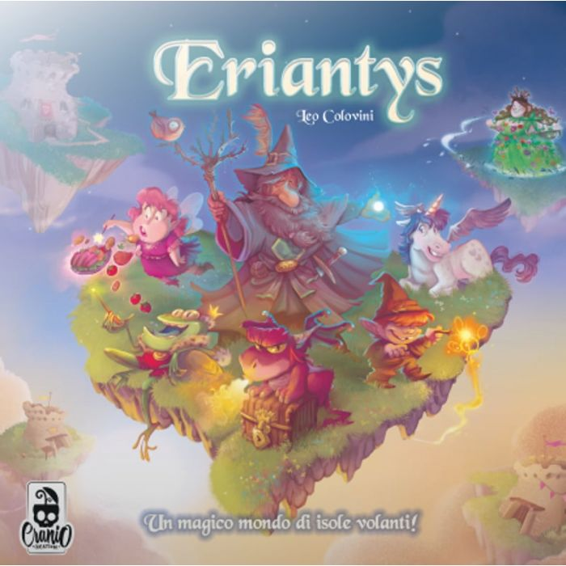

<a name="readme-top"></a>

<!-- PROJECT LOGO -->
<br />
<div align="center">
  <a href="https://github.com/MarioCela/Eriantys_Board_Game_SE">
    
  </a>

<h3 align="center">Eriantys Board Game Implementation</h3>

  <p align="center">
    Eriantys Board Game - Software Engineering Final Project 2022 - Politecnico di Milano
  </p>
  <br />
</div>


<!-- ABOUT THE PROJECT -->
## Eriantys Board Game :dragon:

This is the final project of the Software Engineering course of the Bachelor's Degree at Politecnico di Milano. The course was held by Alessandro Margara.

The assignment of the project was to reproduce the *Eryantis* board game, created by Cranio Creations.

We had to develop the game exploiting the Model-View-Controller (MVC) pattern. Thus, we developed both basic and advanced rules of the game, the socket to allow communications between players connected to the game and the server, and the user interface in two versions: Command-Line Interface (CLI) and Graphical User Interface (GUI).

Images and brief descriptions of all the parts of the project will be provided.


 
| Functionality    |                       State                        |
|:-----------------|:--------------------------------------------------:|
| Basic rules      | ✅ |
| Complete rules   | ✅ |
| Socket           | ✅ |
| GUI              | ✅ |
| CLI              | ✅ |
| 12 Characters    | ✅ |
| Multiple games   | ❌ |
| Persistence      | ❌ |

For the additional functionalities, we decided to develop all the 12 character cards.

Other functionalities, such as concurrent multiple games and allowing the back up of the game after an undesired disconnection, have not been implemented.

<p align="right">(<a href="#readme-top">back to top</a>)</p>

## Implementation Details :dragon_face:

### Model

The model satisfies all the requirements of Eriantys, according to the rules of the board game.

Interesting choices done during the development of the project are:

* Introduction of [PlayerInteraction](src/main/java/it/polimi/ingsw/Model/Player/PlayerInteraction.java) and [IslandInteraction](src/main/java/it/polimi/ingsw/Model/Island/IslandInteraction.java): to distribute classes responsabilities, we decided to introduce these classes that will manage changes of the game state after interactions that involve the players and the islands, respectively. In this way, the [Model](src/main/java/it/polimi/ingsw/Model/Model.java) class is smaller and is not a god component.

* Usage of the decorator pattern to manage cards effects that work with the concept of influence (concept that belongs to the game): the pattern allowed us to exploit polymorphism in order to manage several cards effect in a more object oriented way. For more, involved classes can be found [here](src/main/java/it/polimi/ingsw/Model/Influence/).

* Usage of the state pattern to manage cards effects that involve the method of assignment of teachers to the players: the reason behind is choice is the same the one explained in the previous point. For more, involved classes can be found [here](src/main/java/it/polimi/ingsw/Model/Teacher/).

<p align="right">(<a href="#readme-top">back to top</a>)</p>

## TO BE CONTINUED

<p align="right">(<a href="#readme-top">back to top</a>)</p>


<!-- RUN -->
## Run

### JAR file

In order to open jar files, you need to have a JDK for java installed on your PC.  To run the jar you have to go in the target directory and use this command:  
```java -jar AM05-1.0-SNAPSHOT-jar-with-dependencies.jar``` <p> **The jar file has to be downloaded from the [link](https://polimi365-my.sharepoint.com/:u:/g/personal/10680462_polimi_it/Ed2xABxEAOxLhCfPCKUHEVIBsf4S4F87e2pkwOHbYGWvow?e=Qhd5t4) in the "deliveries" folder and has to be locally put in the directory**</p>
  
**NB** The server always runs on **1234** port.

Now you're ready to play.  

### For command-line users

In order to enable the ANSI color view from **Windows** prompt interface, you may need to run as administrator the [.bat file](https://github.com/MarioCela/Eriantys_Board_Game_SE/blob/main/EnableAnsiCmd.bat) we provided before starting the game.  For a better experience as CLI users
we also recommend to choose a window-size first and not to change it for the rest of the game.

<p align="right">(<a href="#readme-top">back to top</a>)</p>


<!-- LICENSE -->
## License 📄

Distributed under the `MIT` License. See [LICENSE](https://github.com/MarioCela/Eriantys_Board_Game_SE/blob/main/LICENSE) for more information.

<p align="right">(<a href="#readme-top">back to top</a>)</p>


<!-- CONTACT -->
## Group Members 👥

* [Alessandro Calvi](https://github.com/alecalvi00): alessandro4.calvi@mail.polimi.it  
* [Mario Cela](https://github.com/MarioCela): mario.cela@mail.polimi.it  
* [Alberto Ceresoli](https://github.com/AlbertoCeresoli): alberto.ceresoli@mail.polimi.it  

<p align="right">(<a href="#readme-top">back to top</a>)</p>
